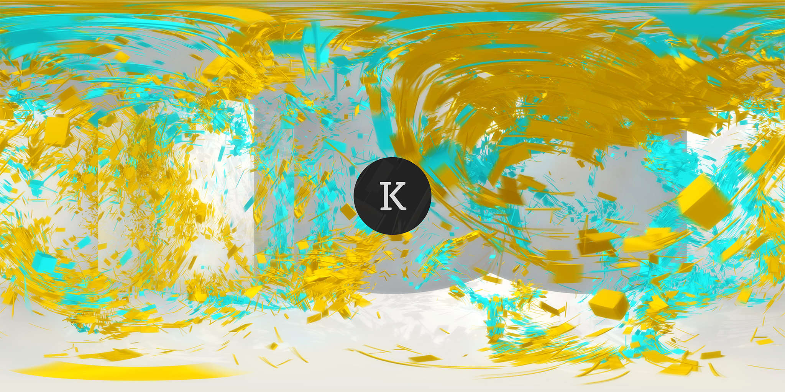
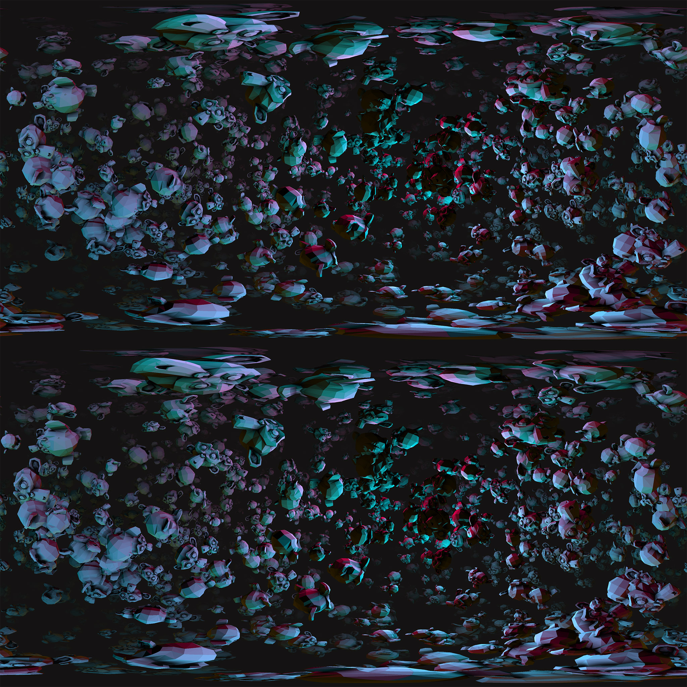

## THREE.Capturer
**THREE.Capturer** is a simple helper created by **[KUVA](https://kuva.io/)** to export **[THREE.JS](threejs.org)** content into Equirectangular format and **[ODS(VR) format](https://developers.google.com/cardboard/jump/rendering-ods-content.pdf)** image.

Check out the **[live demo here](https://kuva.io/THREE.Capturer/)**

If you have a cardboard device, you can check out the still frame ODS export from the demo site on **[Youtube here](https://kuva.io/THREE.Capturer/)**.

### Gallery

Equirectangular result of the KUVA.io homepage:

ODS result of the demo page:

### Example

To use this helper, you need to include the THREE.JS library before the helper.

    var renderer = THREE.WebGLRenderer();
    var scene = THREE.Scene();
    var camera = new THREE.PerspectiveCamera( 70, window.innerWidth / window.innerHeight, 0.01, 500 );
    
    var capturer = new THREE.Capturer( {

        renderer : renderer,
        camera : camera,
        scene : scene,

        // default filename
        fileName: 'capture',

        // file type can be jpg or png
        fileType: 'png'
    } );

    var equirectangularMethod = new THREE.Capturer.methods.Equirectangular( {

        // image size - w: 4096 h: 2048
        size: 4096,

        // cube camera renderTarget size
        cubeSize: 2048

    } );

    var odsMethod = new THREE.Capturer.methods.ODS( {

        // image size - w: 4096 h: 4096
        size: 4096,

        // Interpupillary distance - distance in meter between the center of the pupils of the two eyes
        ipd: 0.064

    } );

    // assign the capturer method you want to use
    capturer.method = odsMethod;

    // render the capturer result on to the canvas. For advanced usage, you can pass the renderTarget to the function to render the result onto a renderTarget.
    capturer.render();

    // save the canvas result as an image file
    capturer.capture( function() {

        console.log( 'complete' );

    } );

### TODO
- Fix the half pixel offset issue in ODS
- ~~Mobile support for the demo page~~

### Development and deployment
- dev: `node dev`
- deploy: `node build`

### License

The MIT License (MIT)

Copyright (c) 2016 Kuva, https://kuva.io/

Permission is hereby granted, free of charge, to any person obtaining a copy of this software and associated documentation files (the "Software"), to deal in the Software without restriction, including without limitation the rights to use, copy, modify, merge, publish, distribute, sublicense, and/or sell copies of the Software, and to permit persons to whom the Software is furnished to do so, subject to the following conditions:

The above copyright notice and this permission notice shall be included in all copies or substantial portions of the Software.

THE SOFTWARE IS PROVIDED "AS IS", WITHOUT WARRANTY OF ANY KIND, EXPRESS OR IMPLIED, INCLUDING BUT NOT LIMITED TO THE WARRANTIES OF MERCHANTABILITY, FITNESS FOR A PARTICULAR PURPOSE AND NONINFRINGEMENT. IN NO EVENT SHALL THE AUTHORS OR COPYRIGHT HOLDERS BE LIABLE FOR ANY CLAIM, DAMAGES OR OTHER LIABILITY, WHETHER IN AN ACTION OF CONTRACT, TORT OR OTHERWISE, ARISING FROM, OUT OF OR IN CONNECTION WITH THE SOFTWARE OR THE USE OR OTHER DEALINGS IN THE SOFTWARE.
